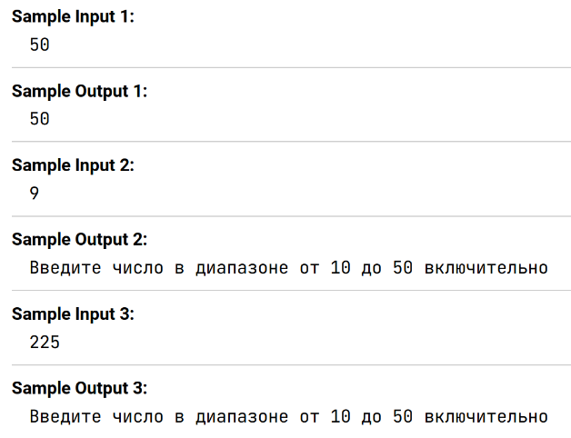

Перед вами объект catalogue, в котором содержится свойство ```magazine: 5```. Измените значение этого свойства на вводимое пользователем числовое значение и выведите его, ***но только если оно не ```меньше 10``` и ```не больше 50```***. ___Если введенное значение находится вне данного диапазона, сообщите об этом пользователю в заявленном формате___. 

