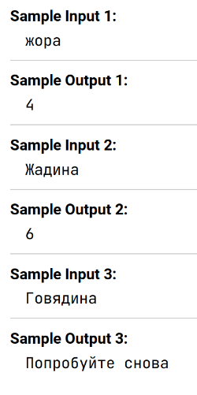

Напишите программу, которая запрашивает ввод строки. Если эта строка начинается с буквы __"ж"__ в верхнем или нижнем регистре, программа выводит длину строки, а иначе выводится сообщение __"Попробуйте снова"__. Используйте метод ``` startsWith```.

