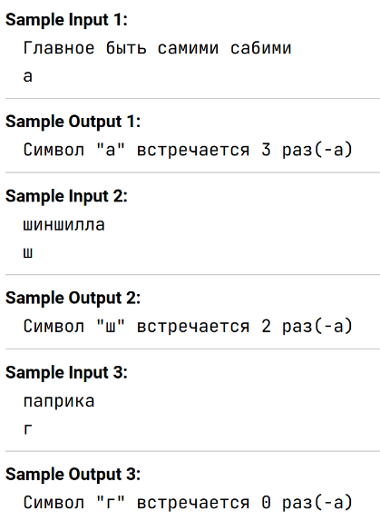

Напишите программу, которая запрашивает у пользователя ввести строку и символ. Программа должна подсчитать, сколько раз данный символ встречается в введенной строке, а затем вывести это количество.

