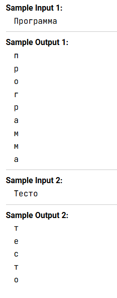

Перед вами программа, которая запрашивает у пользователя строку, а затем выводит каждый символ этой строки на отдельной строке в нижнем регистре. Вставьте вместо многоточия верное выражение.


```js const sentence = prompt();
for (let i = 0; ...; i++) {
  console.log(sentence[i].toLowerCase());
}
```
