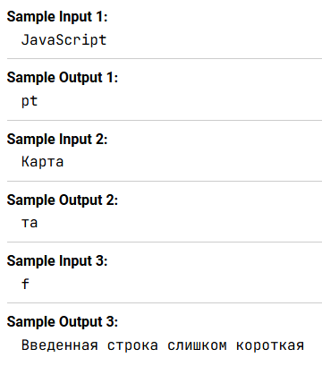

Напишите программу, которая запрашивает у пользователя строку, а затем выводит на экран последние два символа этой строки. Если строка состоит из меньше, чем 2 символов, выведите сообщение о том, что строка слишком короткая

