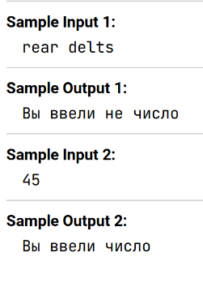

Напишите программу, которая запрашивает у пользователя ввод числа и проверяет, является ли введенное значение числом. Если введенное значение не является числом, программа должна вывести сообщение ```"Вы ввели не число"```. В противном случае программа должна вывести сообщение ```"Вы ввели число"```.

