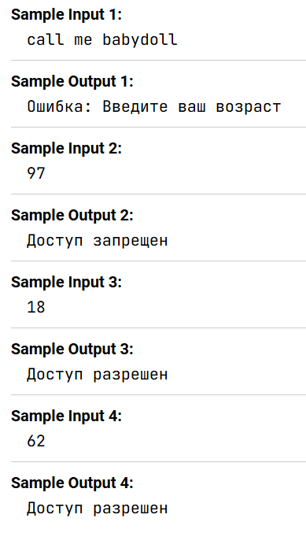

Пользователь вводит возраст. Напишите программу, которая проверяет, является ли введенное значение числом и находится ли оно в диапазоне от 18 до 65 лет включительно. Если введенное значение не является числом, программа выводит сообщение об ошибке. Если число не попадает в диапазон выводится ```"Доступ запрещен"```, в иных случаях выводится сообщение ```"Доступ разрешен"```.

