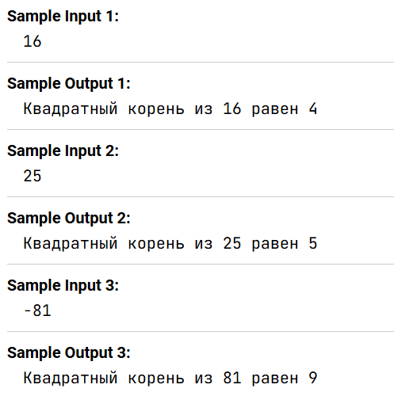

Напишите программу, которая запрашивает у пользователя число, а затем вычисляет и выводит его квадратный корень. Если пользователь ввел отрицательное число, программа преобразует его в положительное.

